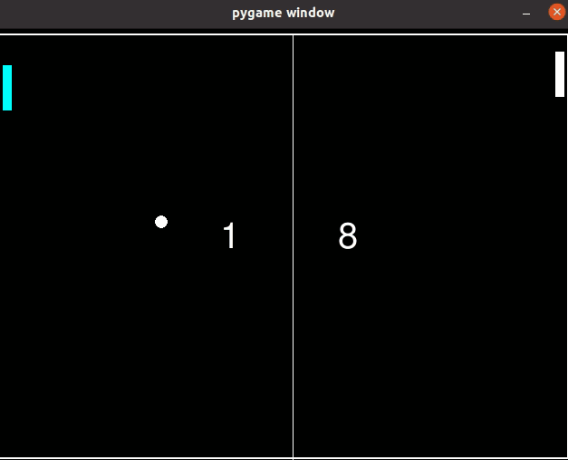
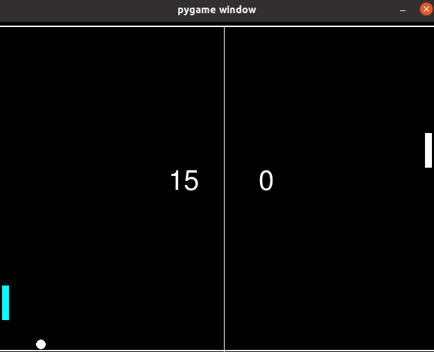

# Deep Q network github

## For quick docker install and train
Make sure install [Nvidia Container Toolkit](https://docs.nvidia.com/datacenter/cloud-native/container-toolkit/install-guide.html) first
* git clone https://github.com/darren1231/DQN-play-games
* cd DQN-play-games/
* docker build -t tf270 .
* docker run -it --gpus all -v /home/darren/code_project/DQN-play-games/:/home/ tf270 /bin/bash

### Inside container
Before trainning, uncomment the code in pong_fun.py, owing to pygame monitor can't be shown in docker


```
## uncomment if train in docker
# os.environ["SDL_VIDEODRIVER"] = "dummy"
```

* cd /home
* python deep_q_network_normal.py 

## Show pygame env
After trainning about 400000 steps,we can show the learning effect with pygame monitor without GPU.

### Install environment from Anaconda
* conda create -n pygameenv python=3.6
* pip install -r requirements.txt

### Before trainning


### After trainning
